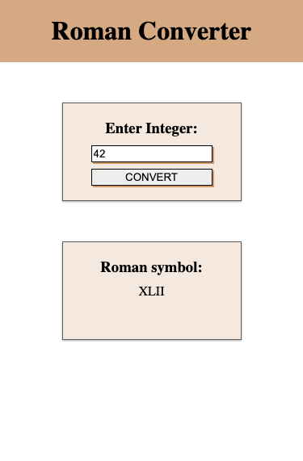

# Roman Numeral Converter

freeCodeCamp JavaScript Algorithms and Data Structures Project #2

This is my solution to the Roman Numeral Converter project from the JavaScript Algorithms and Data Structures curriculum.

## Table of contents

- [Roman Numeral Converter](#roman-numeral-converter)
  - [Table of contents](#table-of-contents)
  - [Overview](#overview)
    - [The challenge](#the-challenge)
    - [Screenshot](#screenshot)
    - [Links](#links)
  - [My process](#my-process)
    - [Built with](#built-with)
    - [Useful resources](#useful-resources)
  - [Author](#author)

## Overview

### The challenge

Users should be able to:

- Convert integers between 1 and 3999 to Roman numeral symbols
- See hover states for convert button
- Receive an error if number is greater than 3999 or less than 1

### Screenshot

### Links

- Solution URL: [Github](https://github.com/Kevin27j/roman-numeral-converter)
- Live Site URL: [Github Pages](https://kevin27j.github.io/roman-numeral-converter/)

## My process

### Built with

- HTML5
- CSS 
- Flexbox
- Mobile-first workflow
- Javascript

### Useful resources

- [How to convert roman numerals](https://blog.prepscholar.com/roman-numerals-converter#:~:text=If%20a%20numeral%20comes%20after,1%20%2B%201%20%2B%201).) - 
  
## Author

- Website - (https://kevin27j.github.io/Bootstrap-Portfolio/)
- Github - [Kevin27j](https://github.com/Kevin27j)